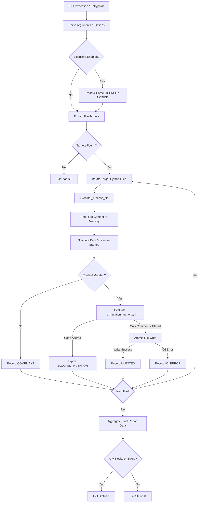
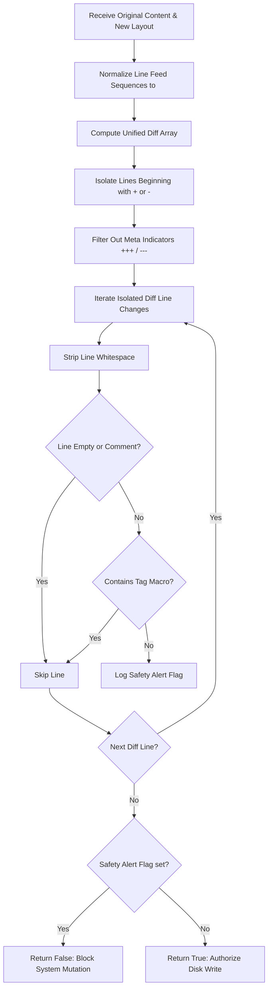
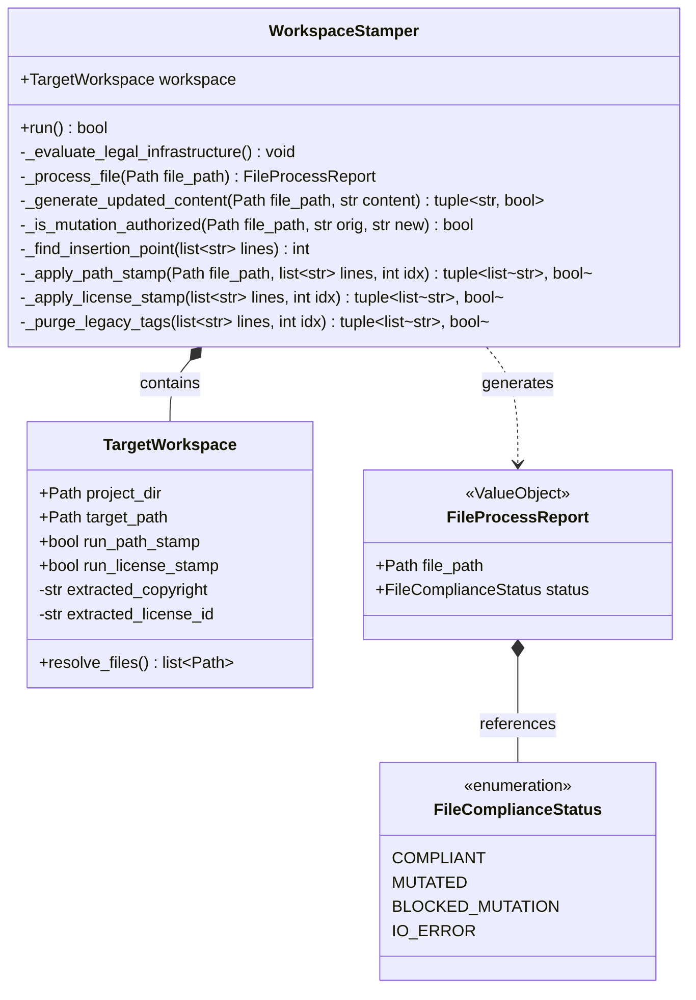

<!-- docs/designs/001-worskpace-stamper-architecture-v0.1.md -->
<!-- SPDX-FileCopyrightText: Copyright (C) 2026 Sebastien Lenard <sebastien.lenard@gmail.com> and Contributors -->
<!-- SPDX-License-Identifier: Apache-2.0 -->

# 0001: Workspace Stamper Architecture v0.1

This document details the architectural specifications and implementation blueprint for the `workspace-stamper` utility within the `coding-tools` suite. It serves as both a human-readable design record and an LLM-interpretable technical prompt.

---

## 1. Executive Summary & Design Goals

The `workspace-stamper` utility injects structural context (relative file paths) and legal metadata (SPDX compliance blocks) into Python projects.

### Core Objectives

* **Deterministic LLM Context Preservation:** Enable accurate directory mapping when raw file content is transferred into Large Language Model context windows.
* **Non-Destructive Execution Safety:** Enforce in-memory verification gates that abort file system operations before corrupting functional source strings.
* **Separation of Concerns:** Decouple low-level file layout operations from high-level workflow orchestration.

---

## 2. Key Architectural Decisions & Rationales

### Decision 1: Shift from Primitive Booleans to Multi-State Enums

* **Context:** Early iterations used boolean flags `(status, is_modified)` to bubble results from low-level functions to the core runtime loop.
* **Problem:** This created "boolean blindness." The loop could not differentiate between an ignored file (no-op), a file that was already compliant, a successfully mutated file, and a safety-blocked operation. Windows line ending variations (`\r\n` vs `\n`) caused frequent false-positive failure traps.
* **Solution:** Introduced a typed `FileComplianceStatus` Enum and a structured `FileProcessReport` value object. The orchestrator now queries explicit states and handles reports contextually.

### Decision 2: In-Memory Layout Compilation with Strict Safety Diffs

* **Context:** Traditional linting tools rewrite assets on disk directly or catch failures post-mutation.
* **Problem:** Direct file mutations risk unintended code deletions if regex boundary checks fail against unpredicted file patterns.
* **Solution:** Implemented atomic verification. Files are read, transformations are simulated in memory, and the original vs. mutated layouts undergo a `unified_diff` inspection. Any structural change mutating non-comment code blocks sets a critical safety alarm and drops disk writes.

---

## 3. Workflow Specifications

### 3.1 Execution Lifecycle

The following diagram illustrates how the `WorkspaceStamper` processes a targeted project tree, evaluates licensing metadata, executes in-memory operations, and outputs report metrics.



### 3.2 In-Memory Safety Engine Inspection

This workflow handles mutated string array validations before executing disk operations.



---

## 4. Architectural Domain Structures

The implementation relies on distinct domain elements to guarantee type safety and clear logical states.

### 4.1 State Definitions

```python
class FileComplianceStatus(Enum):
    """Atomic states representing execution outcomes on a per-file basis."""
    COMPLIANT = auto()          # Already properly formatted. No disk writes needed.
    MUTATED = auto()            # File was non-compliant but safely updated.
    BLOCKED_MUTATION = auto()   # Safety engine blocked unauthorized code changes.
    IO_ERROR = auto()           # Permissions or low-level system failures.

class FileProcessReport(NamedTuple):
    """Value object transferring processing diagnostics up to the executive runtime."""
    file_path: Path
    status: FileComplianceStatus

```

### 4.2 Class Interactions & Data Layouts



---

## 5. File Layout Layout Specifications

The insertion engine sequences headers using a strict prioritization order. This ensures it does not corrupt metadata flags read by the Python interpreter or OS shells.

### Standard Layout Sequence

```text
+-----------------------------------------------------------------------+
| Line 1: Optional Shebang Interpreter Directive (e.g., #!/usr/bin/env) |
+-----------------------------------------------------------------------+
| Line 2: Optional Layout Encoding Declaration (e.g., # coding: utf-8)  |
+-----------------------------------------------------------------------+
| Header Stamp: Relative Source File Tree Path Macro (e.g., # src/a.py) |
+-----------------------------------------------------------------------+
| License Block: SPDX-FileCopyrightText Declarations                     |
+-----------------------------------------------------------------------+
| License Block: SPDX-License-Identifier Constraint                      |
+-----------------------------------------------------------------------+
| Pure Source Code Body Strings                                         |
+-----------------------------------------------------------------------+

```

---

## 6. Verification & Test Strategy

To prevent design regression, the test suite guarantees 100% code branch coverage across four testing boundaries.

### Test Categories

1. **Infrastructure Parsing Tests:** Validate multiple copyright block configurations, empty files, missing legal records, and unexpected input properties.
2. **Layout Modification Tests:** Validate path injection, tag removal, and handling of custom interpreter headers like shebangs.
3. **Safety Engine Assurance Tests:** Verify that mutations involving whitespace variations or comment changes pass safely, while functional modifications are locked down.
4. **CLI Integration Verification:** Simulate command line operations, handling edge cases like omitted arguments, directory paths, and runtime errors.